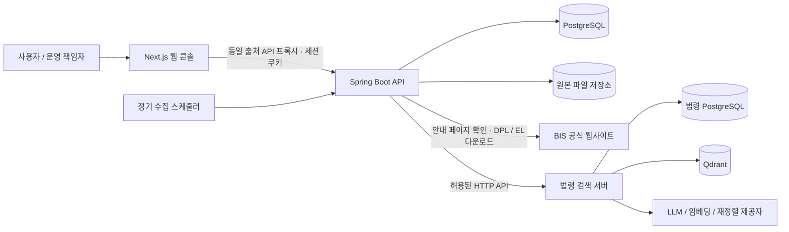

# TradeOps Hub

우려거래자 자료 수집과 법령 검색을 한 화면에서 사용하는 무역안보 업무 도구입니다. 공통 로그인·권한·감사 기능을 사용하며, BIS 데이터 운영과 법령 검색 서버는 각자의 데이터와 처리 책임을 갖습니다.

## 우려거래자 데이터 운영

- 매주 월요일 09:00 정기 수집과 수동 갱신
- 안내 페이지에서 다운로드 링크 재확인, 공식 주소·파일 형식 검증
- 이름·별칭·유사 후보 통합 검색과 개인 검색 이력
- 원본 버전 보관, 큰 감소량 반영 보류 및 확인
- 로그인, 사용자 계정 관리, 비밀번호 변경, 감사 이력
- 한국어 업무 화면과 반응형 메뉴

검색 결과는 원본 정보와 이름 유사도를 제공하며 법률·제재 판단을 자동으로 내리지 않습니다.

## 법령 검색

- 무역안보·방산·기술보호 관련 법령의 자연어 검색
- 키워드·벡터 검색과 재정렬, 근거·답변 품질 검증
- 인용 조문·개정 이력·이전 조문 비교
- 수집·색인·동기화 상태와 검색 로그·요청별 실행 추적

검색 범위는 8개 핵심 법령과 수집된 하위 법령입니다. 전체 대한민국 법령의 실시간 동기화를 제공하지 않으며 답변은 최종 법률 판단을 대신하지 않습니다.

## 저장소 구성

```text
frontend/             Next.js 통합 한국어 화면
backend/              Spring Boot 인증·BIS·감사·법령 API 연결
services/law-search/  Spring Boot 법령 수집·검색·RAG 서버
```

하나의 저장소와 main에서 관리하며 작업별 브랜치를 사용합니다. 서비스 프로세스·DB·벡터 저장소·환경 설정은 분리합니다. 기존 법령 저장소의 41개 커밋은 원래 해시를 유지해 가져왔습니다. [모노레포 운영과 이전](docs/ko/monorepo.md), [법령 검색 통합](docs/ko/law-integration.md)을 참고하세요.

## 실행

Java 17, Maven, Node.js 22 이상, Docker가 필요합니다.

1. `.env.example`을 `.env`로 복사하고 DB 비밀번호와 운영 책임자 초기 비밀번호를 설정합니다.
2. `docker compose up -d`로 PostgreSQL을 실행합니다.
3. `powershell -File scripts/start-api-local.ps1 -MavenPath <mvn.cmd 경로>`로 API를 실행합니다.
4. 다른 터미널의 `frontend`에서 `npm ci`, `npm run dev`를 실행합니다. API 기본 주소는 `http://127.0.0.1:8081`입니다. 다르면 웹 프로세스의 `API_PROXY_TARGET`을 지정합니다.
5. `http://localhost:3000`에 접속해 설정한 운영 책임자 계정으로 로그인합니다. **BIS 자료 수집**에서 첫 수집을 실행합니다.

법령 서비스는 별도 터미널에서 `services/law-search`로 이동해 실행합니다. 해당 디렉터리의 `.env.example`을 참고해 서비스 전용 `.env`를 준비하고 `powershell -File scripts/server.ps1 start -MavenPath <mvn.cmd 경로>`를 실행합니다. PostgreSQL·Qdrant·실제 모델 설정은 [법령 운영 안내](services/law-search/docs/ko/runbook.md)를 따릅니다. Hub API의 `LAW_RAG_BASE_URL`은 법령 서버 주소(로컬 기본 `http://127.0.0.1:8080`)로 설정합니다.

기존 DB·벡터 컬렉션이 있다면 그대로 연결하며 디렉터리 통합 때문에 재수집·재임베딩하지 않습니다. 법령 Compose 프로젝트 이름도 기존 이름으로 고정했습니다. Hub DB 기본 포트는 5433, 법령 DB는 5432이며 실제 환경 설정을 우선합니다.

운영 책임자 계정은 최초 생성 시에만 초기 비밀번호를 사용합니다. 기존 DB 계정 비밀번호를 환경 변수로 덮어쓰지 않습니다. 운영 환경에서는 HTTPS와 `SESSION_COOKIE_SECURE=true`를 설정합니다. 원본 보관 경로를 영속 저장소로 연결하고 PostgreSQL과 함께 백업합니다.

## 검증

전체 검사는 `powershell -File scripts/verify-monorepo.ps1 -MavenPath <mvn.cmd 경로>`로 실행합니다. Hub 검사와 법령 JavaScript 문법·전체 Maven 테스트를 실행하며, 법령 테스트는 임시 H2·mock 설정으로 실제 DB와 모델 호출을 사용하지 않습니다.

`scripts/verify-local.ps1`은 Hub 서버 없이 단위 테스트·검증 도구 테스트·프런트엔드 타입 검사를 실행합니다. 실제 PostgreSQL 통합/성능 검증과 격리 런타임 검증은 [검증 안내](docs/ko/evaluation-harness.md)를 참고하세요. 실데이터와 생성 결과는 Git에 포함하지 않습니다.

## 아키텍처



웹 콘솔은 검색·수집·이력 조회를 제공하고, API는 세션 인증과 권한 확인, 수집·검색·CSV 생성을 담당합니다. PostgreSQL에는 계정·세션·감사 이력과 수집 실행·데이터 버전·검색 인덱스를 저장하며, 내려받은 원본 파일은 별도 영속 저장소에 보관합니다.

수집기는 매번 BIS 안내 페이지에서 다운로드 주소를 확인하고 파일 구조와 이름을 검증합니다. 새 데이터 버전은 검증 후 반영하며, 수집 실패나 급격한 건수 감소로 보류된 경우 기존 데이터를 유지합니다. 검색 결과와 CSV는 동일한 데이터 버전을 사용합니다.

스케줄러와 수집 작업은 API 프로세스 안에서 실행합니다. 통합 구성은 Next.js, Hub Spring Boot API와 법령 Spring Boot 서버, 서비스별 PostgreSQL, 원본 파일 저장소와 Qdrant입니다. 각 서비스는 독립적으로 실행·배포할 수 있습니다.

## 설계 문서

| 문서 | 내용 |
| --- | --- |
| [모노레포 운영](docs/ko/monorepo.md) | 서비스 경계·이력 보존·이전 절차 |
| [법령 서비스 설계](services/law-search/docs/ko/README.md) | RAG 파이프라인·색인·근거 검증 |
| [C4 모델](docs/ko/architecture/c4.md) | 시스템 경계, 실행 구성과 API 내부 컴포넌트 |
| [ADR](docs/ko/adr/README.md) | 주요 설계 결정과 대안, 결과 |
| [arc42](docs/ko/arc42.md) | 요구사항, 실행 흐름, 배포 구성과 품질 목표 |
| [제품 범위](docs/ko/product-scope.md) | 구현 기능과 범위 |
| [API 계약](docs/ko/api-contract.md) | 엔드포인트, 권한과 데이터 계약 |
| [수집·갱신 설계](docs/ko/watchlist-update-design.md) | 원본 검증, 버전 비교와 반영 정책 |
| [운영 안내](docs/ko/runbook.md) | 실행, 환경 설정과 운영 절차 |

BIS [공식 안내 페이지](https://www.bis.gov/licensing/guidance-on-end-user-and-end-use-controls-and-us-person-controls)에서 제공하는 공개 파일을 사용합니다. 회사 코드·내부 데이터·계정 정보를 포함하지 않는 독립 구현입니다.
