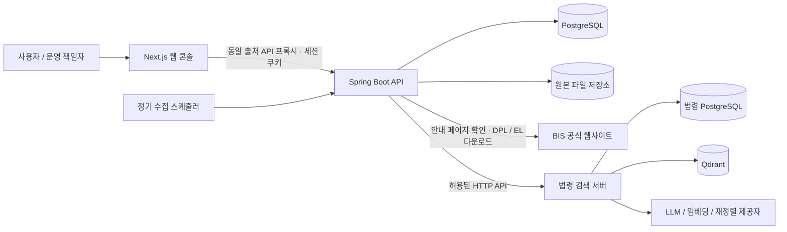

# TradeOps Hub

우려거래자 자료 수집과 법령 검색을 한 화면에서 사용하는 무역안보 업무 도구입니다. 공통 로그인·권한·감사 기능을 사용하며, BIS 데이터 운영과 법령 검색 서버는 각자의 데이터와 처리 책임을 갖습니다.

## 우려거래자 데이터 운영

- 매주 월요일 09:00 정기 수집과 수동 갱신
- 안내 페이지에서 다운로드 링크 재확인, 공식 주소·파일 형식 검증
- 이름·별칭·유사 후보 통합 검색과 개인 검색 이력
- 원본 버전 보관, 큰 감소량 반영 보류 및 확인
- 로그인, 사용자 계정 관리, 비밀번호 변경, 감사 이력
- 한국어 업무 화면과 반응형 메뉴

검색 결과는 원본 정보와 이름 유사도를 제공하며 법률·제재 판단을 자동으로 내리지 않습니다.

## 법령 검색

- 무역안보·방산·기술보호 관련 법령의 자연어 검색
- 키워드·벡터 검색과 재정렬, 근거·답변 품질 검증
- 인용 조문·개정 이력·이전 조문 비교
- 수집·색인·동기화 상태와 검색 로그·요청별 실행 추적

검색 범위는 8개 핵심 법령과 수집된 하위 법령입니다. 전체 대한민국 법령의 실시간 동기화를 제공하지 않으며 답변은 최종 법률 판단을 대신하지 않습니다.

## 주요 화면과 사용 흐름

| 화면 | 사용 흐름 |
| --- | --- |
| 우려거래자 검색 | 이름·별칭 검색 → 출처·국가 필터 → 일치 근거와 상세 확인 → CSV 다운로드 |
| 우려거래자 수집 관리 | 전체 또는 출처별 수집 → 진행 상태 확인 → 수집 이력에서 갱신 내용·원본 확인 |
| 법령 검색 | 질문과 기준일 입력 → 근거 조문을 포함한 답변 → 인용 조문·개정 이력 비교 |
| 법령 검색 관리 | 운영 현황·수집 이력 확인 → 보유 법령과 조문 조회 → 검색 로그에서 요청별 실행 추적 |

## 아키텍처



웹 콘솔은 검색·수집·이력 조회를 제공하고, API는 세션 인증과 권한 확인, 수집·검색·CSV 생성을 담당합니다. PostgreSQL에는 계정·세션·감사 이력과 수집 실행·데이터 버전·검색 인덱스를 저장하며, 내려받은 원본 파일은 별도 영속 저장소에 보관합니다.

```text
frontend/             Next.js 통합 한국어 화면
backend/              Spring Boot 인증·BIS·감사·법령 API 연결
services/law-search/  Spring Boot 법령 수집·검색·RAG 서버
```

서비스 코드는 하나의 저장소에서 관리하고 프로세스·DB·벡터 저장소·환경 설정은 분리합니다.

## 주요 설계 결정

| 문제 | 구현한 방식 |
| --- | --- |
| 수집 실패가 현재 검색 데이터를 훼손할 수 있음 | 검증한 스냅샷을 원자적으로 반영하고, 실패하거나 행 수가 30% 넘게 감소하면 기존 버전을 유지합니다. 큰 감소량은 운영 책임자 확인 후 반영합니다. |
| 공식 다운로드 주소가 변경될 수 있음 | 안내 페이지에서 링크를 다시 찾고, HTTPS·허용된 공식 호스트·파일 구조를 검증합니다. |
| 검색 이후 수집이 일어나면 화면과 CSV가 달라질 수 있음 | 검색·페이지 이동·CSV 다운로드가 같은 출처별 스냅샷을 사용합니다. |
| 이름이 비슷해도 동일 기업이라고 단정할 수 없음 | 원본 이름과 일치 근거를 제공하고, 최종 판단은 사용자에게 남깁니다. |
| 법령 답변의 근거와 처리 과정을 확인해야 함 | 인용 조문을 응답 조건으로 검증하고, 요청 ID로 검색 로그와 단계별 실행 추적을 연결합니다. |
| 통합 화면에서도 서비스 경계를 유지해야 함 | Hub가 인증과 허용된 API 연결을 담당하고, 법령 서버가 원문·임베딩·답변 생성을 담당합니다. 관리 권한은 백엔드에서 확인합니다. |

## 검증 결과와 현재 한계

2026-09-11까지 수행한 검증 기준입니다. 상세 수행 기록은 [작업 목록](tasks/todo.md), 검증 방법은 [검증 안내](docs/ko/evaluation-harness.md)에 있습니다.

- **회귀 검증:** Hub 서버 없이 실행하는 검증 절차와 법령 서비스 194개 테스트가 통과했습니다. 법령 테스트는 임시 H2·모의 제공자로 실제 데이터와 분리했습니다.
- **데이터 보존:** 통합 저장소로 법령 서버를 이전한 뒤 법령 44개, 조문 4,112개, 색인 조문 4,431개와 기존 스냅샷이 유지되는 것을 확인했습니다.
- **검색 성능:** 2026-09-09 가상 데이터 10,000행·동시 클라이언트 5개·검색 100회 조건에서 검색 p95 122ms, CSV 398ms를 기록했습니다. 해당 로컬 검증 환경의 결과이며 법령 답변 생성 시간은 포함하지 않습니다.
- **화면과 연동:** 실제 법령 질의의 인용·로그·추적 연결과 관리 화면의 요청 선택, 내부 스크롤, 데스크톱·좁은 화면 배치를 확인했습니다.

현재 BIS 수집 작업은 단일 API 인스턴스에서 실행합니다. 법령 검색은 수집된 법령 범위에 한정되며, 저장 조문과 색인 조문 수가 다른 기존 상태는 갱신 확인 과제로 남아 있습니다. 공개 서비스의 장기 가용성이나 전체 기능의 최신 통합 인수 검사를 완료했다는 의미는 아닙니다.

## 설계 문서

| 문서 | 내용 |
| --- | --- |
| [모노레포 운영](docs/ko/monorepo.md) | 서비스 경계·이력 보존·이전 절차 |
| [법령 서비스 설계](services/law-search/docs/ko/README.md) | RAG 파이프라인·색인·근거 검증 |
| [C4 모델](docs/ko/architecture/c4.md) | 시스템 경계, 실행 구성과 API 내부 컴포넌트 |
| [ADR](docs/ko/adr/README.md) | 주요 설계 결정과 대안, 결과 |
| [arc42](docs/ko/arc42.md) | 요구사항, 실행 흐름, 배포 구성과 품질 목표 |
| [제품 범위](docs/ko/product-scope.md) | 구현 기능과 범위 |
| [API 계약](docs/ko/api-contract.md) | 엔드포인트, 권한과 데이터 계약 |
| [수집·갱신 설계](docs/ko/watchlist-update-design.md) | 원본 검증, 버전 비교와 반영 정책 |
| [운영 안내](docs/ko/runbook.md) | 실행, 환경 설정과 운영 절차 |
| [검증 안내](docs/ko/evaluation-harness.md) | 검증 명령·격리 환경·검사 범위 |

BIS [공식 안내 페이지](https://www.bis.gov/licensing/guidance-on-end-user-and-end-use-controls-and-us-person-controls)에서 제공하는 공개 파일을 사용합니다. 회사 코드·내부 데이터·계정 정보를 포함하지 않는 독립 구현입니다.
