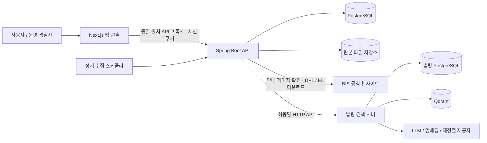

# TradeOps Hub

우려거래자 자료 수집과 법령 검색을 한곳에서 처리하는 무역안보 업무 도구입니다. BIS 공개 자료를 주기적으로 수집하고 이름 검색과 CSV 다운로드를 제공합니다. 법령 검색에서는 질문에 대한 답변과 근거 조문, 개정 이력을 함께 확인할 수 있습니다.

## 주요 화면

| 화면 | 사용 흐름 |
| --- | --- |
| 우려거래자 검색 | 이름·별칭 입력 → 출처·국가 필터 → 일치 근거와 상세 확인 → CSV 다운로드 |
| 우려거래자 수집 관리 | 전체 또는 출처별 수집 → 진행 상태 확인 → 수집 이력에서 갱신 내용·원본 확인 |
| 법령 검색 | 질문과 기준일 입력 → 답변과 근거 조문 확인 → 인용 조문·개정 이력 비교 |
| 법령 검색 관리 | 운영 현황·수집 이력 확인 → 보유 법령과 조문 조회 → 검색 로그에서 요청별 실행 추적 |

## 주요 기능

### 우려거래자 조회·수집

- BIS 수출권한 거부자 목록(DPL)과 우려거래자 목록(Entity List)의 수동·정기 수집
- 공식 안내 페이지의 다운로드 링크 재확인과 원본 파일 보관
- 이름·별칭·유사 후보 검색, 출처·국가 필터와 개인 검색 이력
- 검색 결과 CSV 다운로드와 수집별 추가·제외 내역 확인

검색 결과는 원본 정보와 이름 유사도를 제공합니다. 일치 결과만으로 동일 기업 여부나 제재 적용을 판단하지 않습니다.

### 법령 검색

- 무역안보·방산·기술보호 관련 질문과 기준일에 따른 법령 검색
- 키워드·벡터 검색과 재정렬을 거친 근거 조문 제시
- 인용 조문 열람, 개정 이력 조회와 이전 조문 비교
- 수집·색인 상태 확인과 검색 요청별 처리 과정 추적

검색 대상은 8개 핵심 법령과 수집된 하위 법령입니다. 답변은 수집된 자료를 바탕으로 하며 최종 법률 판단을 대신하지 않습니다.

### 공통 운영

로그인·비밀번호 변경·개인 검색 이력을 제공하며, 운영 책임자는 사용자 계정과 감사 이력을 관리합니다. 한국어 업무 화면에서 조회·수집 상태를 확인하고 필요한 상세 정보로 이동할 수 있습니다.

## 시스템 구조



웹 콘솔은 검색·수집·이력 조회를 제공하고, API는 세션 인증과 권한 확인, 수집·검색·CSV 생성을 담당합니다. PostgreSQL에는 계정·세션·감사 이력과 수집 실행·데이터 버전·검색 인덱스를 저장하며, 내려받은 원본 파일은 별도 영속 저장소에 보관합니다.

```text
frontend/             Next.js 통합 한국어 화면
backend/              Spring Boot 인증·BIS·감사·법령 API 연결
services/law-search/  Spring Boot 법령 수집·검색·RAG 서버
```

Hub와 법령 서버는 각각의 프로세스·DB·환경 설정으로 실행합니다. 법령 서버는 원문 수집, 임베딩과 검색, 답변 생성을 담당합니다.

## 주요 설계 결정

| 문제 | 구현한 방식 |
| --- | --- |
| 수집 실패가 현재 검색 데이터를 훼손할 수 있음 | 검증한 스냅샷을 원자적으로 반영하고, 실패하거나 행 수가 30% 넘게 감소하면 기존 버전을 유지합니다. 큰 감소량은 운영 책임자 확인 후 반영합니다. |
| 공식 다운로드 주소가 변경될 수 있음 | 안내 페이지에서 링크를 다시 찾고, HTTPS·허용된 공식 호스트·파일 구조를 검증합니다. |
| 검색 이후 수집이 일어나면 화면과 CSV가 달라질 수 있음 | 검색·페이지 이동·CSV 다운로드가 같은 출처별 스냅샷을 사용합니다. |
| 이름이 비슷해도 동일 기업이라고 단정할 수 없음 | 원본 이름과 일치 근거를 제공하고, 최종 판단은 사용자에게 남깁니다. |
| 법령 답변의 근거와 처리 과정을 확인해야 함 | 인용 조문을 응답 조건으로 검증하고, 요청 ID로 검색 로그와 단계별 실행 추적을 연결합니다. |
| 통합 화면에서도 서비스 경계를 유지해야 함 | Hub가 인증과 허용된 API 연결을 담당하고, 법령 서버가 원문·임베딩·답변 생성을 담당합니다. 관리 권한은 백엔드에서 확인합니다. |

## 품질 검증

| 영역 | 검증 내용 |
| --- | --- |
| 데이터 무결성 | 수집 실패 시 기존 데이터 보존, 검증된 버전의 원자적 반영, 큰 감소량 승인과 재시작 복구 |
| 인증과 권한 | 세션·CSRF 검증, 운영 책임자 권한, 사용자별 검색 이력 격리 |
| 검색과 다운로드 | 이름 정규화·유사 검색, 버전 고정, CSV 원본 필드 매핑과 이스케이프 |
| 법령 답변 | 인용 조문 응답 조건, 입력 검증, 검색 로그와 단계별 실행 추적의 요청 ID 일치 |
| 화면 연동 | 법령 질의·인용·이력 조회, 로그 선택과 실행 추적 연결, 화면 크기에 따른 배치와 내부 스크롤 |

법령 서비스는 임시 H2와 모의 제공자를 사용하는 회귀 테스트 194개를 통과했습니다. Hub는 단위·PostgreSQL 통합 검사와 실행 중인 서비스의 인증·검색·다운로드 흐름을 검증합니다.

우려거래자 검색은 가상 데이터 10,000행, 동시 클라이언트 5개, 검색 100회 조건에서 **검색 p95 122ms, CSV 다운로드 398ms**를 기록했습니다. 로컬 검증 환경의 측정값이며 법령 답변 생성 시간은 포함하지 않습니다. 검사 범위와 재현 절차는 [검증 안내](docs/ko/evaluation-harness.md)를 참고하세요.

## 상세 문서

| 문서 | 내용 |
| --- | --- |
| [C4 모델](docs/ko/architecture/c4.md) | 시스템 경계와 서비스 구성 |
| [ADR](docs/ko/adr/README.md) | 주요 설계 결정과 대안 |
| [arc42](docs/ko/arc42.md) | 요구사항·실행 흐름·품질 목표 |
| [법령 서비스 설계](services/law-search/docs/ko/README.md) | RAG 파이프라인·색인·근거 검증 |
| [수집·갱신 설계](docs/ko/watchlist-update-design.md) | 원본 검증·버전 비교·반영 정책 |
| [API 계약](docs/ko/api-contract.md) | 엔드포인트·권한·데이터 계약 |
| [운영 안내](docs/ko/runbook.md) | 실행·환경 설정·백업과 운영 제약 |
| [검증 안내](docs/ko/evaluation-harness.md) | 검사 범위·격리 환경·재현 방법 |

자료 출처: 미국 산업안보국(BIS)의 [공식 안내 페이지](https://www.bis.gov/licensing/guidance-on-end-user-and-end-use-controls-and-us-person-controls)에서 제공하는 DPL·Entity List 공개 파일.
