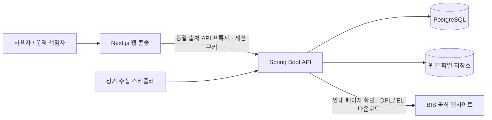

# TradeOps Hub

BIS 우려거래자 자료를 수집하고 이름으로 조회하는 업무 도구입니다. DPL과 Entity List의 원본·수집 이력·변경 내역을 보관하고, 조회한 버전 그대로 CSV를 내려받을 수 있습니다.

- 매주 월요일 09:00 정기 수집과 수동 갱신
- 안내 페이지에서 다운로드 링크 재확인, 공식 주소·파일 형식 검증
- 이름·별칭·유사 후보 통합 검색과 개인 검색 이력
- 원본 버전 보관, 큰 감소량 반영 보류 및 확인
- 로그인, 사용자 계정 관리, 비밀번호 변경, 감사 이력
- 한국어 업무 화면과 반응형 메뉴

검색 결과는 원본 정보와 이름 유사도를 제공하며 법률·제재 판단을 자동으로 내리지 않습니다.

## 실행

Java 17, Maven, Node.js 22 이상, Docker가 필요합니다.

1. `.env.example`을 `.env`로 복사하고 DB 비밀번호와 운영 책임자 초기 비밀번호를 설정합니다.
2. `docker compose up -d`로 PostgreSQL을 실행합니다.
3. `powershell -File scripts/start-api-local.ps1 -MavenPath <mvn.cmd 경로>`로 API를 실행합니다.
4. 다른 터미널의 `frontend`에서 `npm ci`, `npm run dev`를 실행합니다. API 기본 주소는 `http://127.0.0.1:8081`입니다. 다르면 웹 프로세스의 `API_PROXY_TARGET`을 지정합니다.
5. `http://localhost:3000`에 접속해 설정한 운영 책임자 계정으로 로그인합니다. **BIS 자료 수집**에서 첫 수집을 실행합니다.

운영 책임자 계정은 최초 생성 시에만 초기 비밀번호를 사용합니다. 기존 DB 계정 비밀번호를 환경 변수로 덮어쓰지 않습니다. 운영 환경에서는 HTTPS와 `SESSION_COOKIE_SECURE=true`를 설정합니다. 원본 보관 경로를 영속 저장소로 연결하고 PostgreSQL과 함께 백업합니다.

## 검증

`scripts/verify-local.ps1`은 서버 없이 단위 테스트·검증 도구 테스트·프런트엔드 타입 검사를 실행합니다. 실제 PostgreSQL 통합/성능 검증과 격리 런타임 검증은 [검증 안내](docs/evaluation-harness.md)를 참고하세요. 실데이터와 생성 결과는 Git에 포함하지 않습니다.

## 아키텍처

웹 콘솔은 검색·수집·이력 조회를 제공하고, API는 세션 인증과 권한 확인, 수집·검색·CSV 생성을 담당합니다. PostgreSQL에는 계정·세션·감사 이력과 수집 실행·데이터 버전·검색 인덱스를 저장하며, 내려받은 원본 파일은 별도 영속 저장소에 보관합니다.

수집기는 매번 BIS 안내 페이지에서 다운로드 주소를 확인하고 파일 구조와 이름을 검증합니다. 새 데이터 버전은 검증 후 반영하며, 수집 실패나 급격한 건수 감소로 보류된 경우 기존 데이터를 유지합니다. 검색 결과와 CSV는 동일한 데이터 버전을 사용합니다.

스케줄러와 수집 작업은 API 프로세스 안에서 실행합니다. 현재 배포 구성은 Next.js 1개, Spring Boot 1개, PostgreSQL과 원본 파일 저장소입니다.

## 설계 문서

| 문서 | 내용 |
| --- | --- |
| [C4 모델](docs/architecture/c4.md) | 시스템 경계, 실행 구성과 API 내부 컴포넌트 |
| [ADR](docs/adr/README.md) | 주요 설계 결정과 대안, 결과 |
| [arc42](docs/arc42.md) | 요구사항, 실행 흐름, 배포 구성과 품질 목표 |
| [제품 범위](docs/product-scope.md) | 구현 기능과 범위 |
| [API 계약](docs/api-contract.md) | 엔드포인트, 권한과 데이터 계약 |
| [수집·갱신 설계](docs/watchlist-update-design.md) | 원본 검증, 버전 비교와 반영 정책 |
| [운영 안내](docs/runbook.md) | 실행, 환경 설정과 운영 절차 |

BIS [공식 안내 페이지](https://www.bis.gov/licensing/guidance-on-end-user-and-end-use-controls-and-us-person-controls)에서 제공하는 공개 파일을 사용합니다. 회사 코드·내부 데이터·계정 정보를 포함하지 않는 독립 구현입니다.
