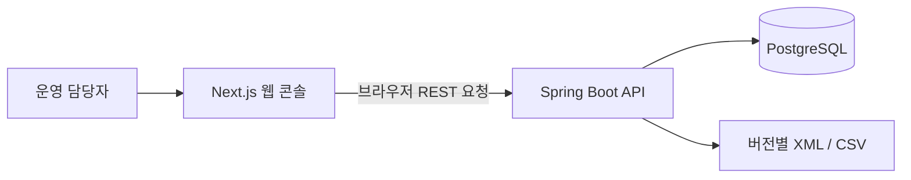

# TradeOps Hub

거래 데이터와 거래상대방 목록의 갱신·검토 작업을 한곳에서 관리하는 운영 콘솔입니다. 목록을 버전별로 저장하고, 이전 버전과 달라진 항목을 확인하며, 각 실행의 처리 결과를 추적합니다.

## 주요 기능

- **목록 갱신** — XML·CSV 원본을 검증하고 버전별 스냅샷을 저장합니다.
- **변경 검토** — 추가·변경·삭제 항목과 필드별 변경 내용을 확인합니다.
- **실행 이력** — 처리 건수, 실패 코드, 요청 추적 ID를 조회합니다.
- **거래 데이터 API** — CSV 업로드, 행 검증, 중복 탐지, 거래 검색을 제공합니다.
- **접근 제어** — 관리자·운영자·조회자 역할로 목록 갱신과 업로드 권한을 구분합니다.

웹 콘솔은 목록 갱신·현재 목록·변경 검토·실행 이력을 제공합니다. 거래 업로드와 검토 기록은 현재 API로 사용합니다. 기본 목록 공급자는 저장소에 포함된 가상 XML·CSV를 읽으며 외부 기관에 연결하지 않습니다. 검토 기록은 담당자의 후속 판단을 위한 정보입니다.

## 시작하기

Java 17, Maven 3.9 이상, Node.js 20.9 이상과 npm, Docker Compose가 필요합니다.

```powershell
Copy-Item .env.example .env
# .env의 POSTGRES_PASSWORD와 JWT_SECRET을 로컬 값으로 설정합니다.
docker compose up -d postgres
.\scripts\start-api-local.ps1 -MavenPath C:\path\to\mvn.cmd
```

별도 터미널에서 웹 콘솔을 실행합니다.

```powershell
cd frontend
npm ci
npm run dev
```

기본 주소는 웹 `http://localhost:3000`, API `http://localhost:8081/api/v1`입니다. 환경 설정, 로컬 계정, 실행 순서는 [운영 안내](docs/runbook.md)를 참고하세요.

## 구조



| 문서 | 내용 |
| --- | --- |
| [C4 모델](docs/architecture/c4.md) | 시스템 경계, 실행 단위, API 내부 컴포넌트 |
| [ADR](docs/adr/README.md) | 주요 설계 결정과 대안, 결과 |
| [arc42](docs/arc42.md) | 요구사항, 실행 흐름, 배포, 품질 및 기술 부채 |
| [API 계약](docs/api-contract.md) | 현재 엔드포인트, 권한, 응답과 오류 처리 |
| [갱신 설계](docs/watchlist-update-design.md) | 버전 비교와 중복 실행 처리 |

## 검증과 개발 상태

```powershell
.\scripts\verify-local.ps1 -MavenPath C:\path\to\mvn.cmd
```

로컬 검증은 백엔드 테스트, 프런트엔드 타입 검사, 검증 도구 테스트를 실행합니다. 실제 PostgreSQL 검증은 다음 명령으로 실행합니다.

```powershell
.\scripts\verify-final.ps1 -MavenPath C:\path\to\mvn.cmd
```

최종 게이트는 별도 PostgreSQL·API·웹을 시작해 11개 고정 시나리오와 저장 결과를 확인하고, 생성한 프로세스와 임시 DB를 정리합니다. 실행 결과는 Git에서 제외된 `artifacts/final/`에 저장됩니다. 기존 로컬 DB는 사용하지 않습니다. 가져오기 이력 조회, 일반 로그인 화면, 외부 원본 연결 등 남은 범위는 [작업 목록](tasks/todo.md)에서 관리합니다.
