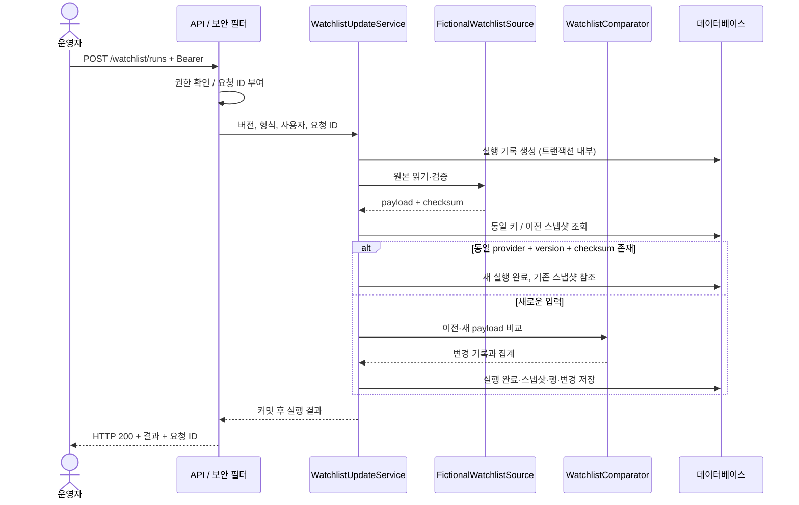

# arc42 아키텍처 설명

기준일: 2026-09-08. 현재 구현과 운영 전 보완 사항을 arc42의 12개 항목으로 정리합니다. 구조도는 [C4 모델](architecture/c4.md), 결정 이력은 [ADR](adr/README.md)을 참조합니다.

## 1. 소개와 목표

TradeOps Hub는 목록 원본을 검증·저장하고 이전 버전과의 차이를 담당자가 검토하는 업무를 지원합니다. 거래 CSV 가져오기와 검토 기록 API를 같은 시스템에서 제공합니다.

| 이해관계자 | 필요한 결과 |
| --- | --- |
| 운영 담당자 | 갱신 성공·실패와 변경 항목 확인, 거래 데이터 입력 |
| 조회 담당자 | 현재 목록과 실행 결과 확인 |
| 관리자 | 접근 권한과 서비스 상태 확인 |
| 유지보수 담당자 | 재현 가능한 입력, 코드와 연결된 설계·검증 기록 |

우선 품질 목표는 변경의 추적 가능성, 반복 실행의 일관성, 실패 시 기존 목록 보존, 서버 권한 제어입니다. 완료 여부는 기능별 테스트와 실행 환경 검증으로 판단합니다.

## 2. 제약사항

- Java 17 / Spring Boot, Next.js / TypeScript, PostgreSQL을 사용합니다.
- 저장소의 원본 데이터는 재현 가능한 가상 자료이며 `dataOrigin=FICTIONAL`을 요구합니다.
- 실제 공급자 연결, 일정 기반 수집, 자동 매칭은 현재 제공하지 않습니다.
- 환경별 설정은 환경변수로 전달하며 로컬 `.env`와 실행 결과는 Git에서 제외합니다.
- 사람의 검토 기록을 지원하며 자동 규제 판단을 제공하지 않습니다.
- 현재 웹 로그인은 로컬 운영자 계정으로 연결됩니다. 일반 사용자 계정 입력·관리 화면은 없습니다.

## 3. 시스템 범위와 맥락

브라우저와 직접 API를 호출하는 클라이언트가 시스템의 사용자 접점입니다. 웹은 화면 리소스를 제공하고 브라우저가 API와 통신합니다. 현재 데이터 공급자는 API 클래스패스 안의 리소스이므로 외부 시스템 연결은 없습니다.

| 경계 | 입력 | 출력 |
| --- | --- | --- |
| 로그인 | 사용자명·비밀번호 | Bearer 토큰·사용자 역할 |
| 목록 갱신 | 버전·XML/CSV 형식 | 실행 상태·스냅샷 ID·집계 |
| 목록 조회 | 검색어·국가·상태·페이지 | 최신 스냅샷 행 또는 변경 기록 |
| 거래 가져오기 | multipart CSV | 승인·거절·중복 건수 |
| 검토 기록 | 거래·목록 식별자·점수·처분 | 기록 상태·요청 추적 ID |

## 4. 해결 전략

업무 처리는 단일 API 프로세스에 두고 데이터베이스 트랜잭션으로 묶습니다. 목록을 수정하는 대신 버전별 전체 스냅샷을 추가하며, 원본 체크섬으로 반복 입력을 식별합니다. 비교 기준은 공급자와 외부 식별자입니다.

정규화된 필드 해시는 의미 있는 변경을 구분하고, 원본 해시는 입력의 동일성을 구분합니다. 동일한 내용의 XML·CSV는 원본 해시가 다를 수 있습니다. 빠른 통합 테스트는 H2로 수행하되 PostgreSQL 실행 검증을 별도 단계로 둡니다.

## 5. 구성 요소

[C4 API 컴포넌트](architecture/c4.md#3-api-컴포넌트)에 코드 의존성을 표시했습니다.

| 구성 요소 | 책임 | 저장 대상 |
| --- | --- | --- |
| 인증·보안 필터 | 사용자 인증, JWT, 역할 검사 | `app_users` |
| 목록 갱신 서비스 | 원본 읽기·비교·완료/실패 저장 | `watchlist_source_runs`, `watchlist_snapshots`, `watchlist_snapshot_records`, `watchlist_changes` |
| 목록 조회 서비스 | 최신 스냅샷 기준 페이지 조회 | 목록 관련 테이블 읽기 |
| 거래 가져오기 서비스 | 헤더·행 검증, 중복 탐지 | `import_runs`, `trade_transactions`, `import_row_rejections` |
| 거래 조회 서비스 | 검색·월별 집계 | 거래 테이블 읽기 |
| 검토 컨트롤러 | 검토 기록과 감사 SQL 실행 | `screening_reviews`, `audit_events` |

검토 컨트롤러의 직접 SQL과 거래 서비스의 직접 JDBC는 계층 분리의 후속 대상입니다.

## 6. 실행 관점

### 6.1 새 목록 버전 갱신

새 버전 A는 추가 4건입니다. A 다음 B를 실행하면 추가 1·변경 1·삭제 1·유지 2건입니다. 같은 B/CSV를 다시 실행하면 기존 스냅샷을 반환하며 새 변경 행은 생성하지 않습니다. 최신 판단은 버전 문자열 정렬이 아니라 스냅샷 ID 순서입니다.

### 6.2 원본 실패

리소스가 없거나 파싱에 실패하여 `WatchlistPayloadException`이 발생하면 `FAILED` 실행과 안전한 코드를 저장합니다. 스냅샷은 생성하지 않습니다. 응답은 HTTP 200일 수 있으므로 클라이언트는 본문의 `status`를 확인해야 합니다. DB·직렬화 장애까지 실패 실행으로 남기는 구조는 아직 아닙니다.

### 6.3 거래 가져오기와 검토

파일 체크섬이 이미 있으면 새 실행 없이 `DUPLICATE_FILE`을 반환합니다. 새로운 CSV는 헤더와 각 행을 검증합니다. 승인 행은 실행 ID와 연결하고 거절·중복 행은 행 번호와 오류 코드를 저장합니다. 일부 행이 제외되면 `COMPLETED_WITH_ERRORS`가 됩니다. 현재 CSV 파서는 단순 쉼표 구분이며 인용부호 안의 쉼표를 지원하지 않습니다.

검토 API는 전달받은 점수·처분·사용자·시각을 저장한 뒤 감사 이벤트를 기록합니다. 자동 매칭 계산과 검토 대상의 참조 무결성 검사는 구현되어 있지 않습니다.

## 7. 배포 관점

로컬에서는 PostgreSQL 16을 Docker Compose로 실행하고 API와 웹을 호스트 프로세스로 실행합니다. DB 볼륨은 `tradeops-postgres-data`입니다. Flyway는 API 시작 시 마이그레이션을 적용하고 Hibernate는 스키마를 검증합니다.

| 구성 | 기본 포트 | 설정 |
| --- | --- | --- |
| 웹 | 3000 | 실행 CLI, `NEXT_PUBLIC_API_BASE` |
| API | 8081 | `API_PORT`, `TRADEOPS_WEB_ALLOWED_ORIGIN` |
| PostgreSQL | 5432 | `DB_HOST`, `POSTGRES_PORT`, DB 이름·사용자·비밀번호 |

`WEB_PORT`는 현재 스크립트가 자동 소비하지 않습니다. 포트를 바꾸려면 웹 실행 인자와 API의 허용 origin을 함께 바꿉니다. 운영 배포, TLS, 백업·복구, CI는 아직 자동화되어 있지 않습니다. [운영 안내](runbook.md)에 로컬 실행 절차를 정리했습니다.

## 8. 공통 개념

- **식별:** 목록 항목은 `provider + externalId`, 거래는 `transactionId`로 식별합니다.
- **현재 상태:** 최신 스냅샷의 행을 조회합니다. 별도 현재 목록 테이블은 없습니다.
- **불변성:** 완료된 스냅샷과 집계는 애플리케이션에서 수정하지 않는 규칙입니다. DB 수준 강제는 미완료입니다.
- **추적:** `X-Correlation-Id`는 8–64자의 영숫자·하이픈만 수용하고 나머지는 UUID로 대체합니다.
- **오류:** 요청 본문 검증과 인증 오류는 안전한 공통 코드로 응답합니다. 모든 예외의 공통 형식 보장은 아직 미완료입니다.
- **권한:** 목록 갱신·업로드는 운영자/관리자, 관리 API는 관리자입니다. 검토 API의 역할 제한은 보완해야 합니다.
- **개인정보:** 원본 행을 오류로 되돌리지 않고 식별자·집계·오류 코드를 사용합니다.
- **환경:** 로컬 시드 계정은 `SEED_DEMO_USERS`로 활성화합니다. 시드 계정과 공개 예제 키는 외부 서비스의 인증 구성이 아닙니다.

## 9. 아키텍처 결정

[ADR 목록](adr/README.md)에 웹·API 분리, 버전별 스냅샷, 로컬 소스 경계, 권한·추적 정책을 기록했습니다. 각 문서에 대안과 현재 구현 한계를 포함합니다.

## 10. 품질 요구사항과 검증

| 시나리오 | 기대 결과 | 현재 근거 / 추가 검증 |
| --- | --- | --- |
| 같은 B/CSV 재실행 | 스냅샷·변경 중복 없음 | `WatchlistRunIntegrationTest`와 고정 시나리오 |
| A 다음 B 갱신 | 추가 1·변경 1·삭제 1·유지 2 | 갱신·비교 테스트 |
| 조회자가 갱신·업로드 호출 | HTTP 403 | 갱신·가져오기 통합 테스트 |
| 원본 리소스 없음 | 안전한 FAILED 응답, 스냅샷 생성 없음 | 갱신 통합 테스트; 기존 목록 보존의 런타임 검증은 남음 |
| 거래 ID 중복 | 중복 집계와 거절 행 보존 | `TransactionImportIntegrationTest` |
| 상태 조회 | 비밀값 없이 API 상태 응답 | `HealthControllerTest` |
| 화면 문구 | 업무 기능 중심, 가상 데이터 표시 유지 | `console-product-copy` 고정 시나리오 |

서버 없는 게이트는 `scripts/verify-local.ps1`입니다. `harness/scenarios.json`은 수용 기준이며 그 자체로 실행 증빙이 아닙니다. 실행 서비스 검증·증빙 스크립트와 CI는 후속 작업입니다. 처리량·지연 시간 목표는 아직 측정·합의하지 않았습니다.

## 11. 위험과 기술 부채

| 항목 | 현재 영향 | 다음 조치 |
| --- | --- | --- |
| 월별 집계의 H2 전용 SQL | PostgreSQL에서 집계 실패; 웹의 병렬 로딩도 함께 실패할 수 있음 | PostgreSQL 쿼리와 실제 DB 테스트 |
| 검토 API 역할 제한 누락 | 조회자도 검토 기록 가능 | 서버 역할 검사와 거부 테스트 |
| 검토·감사 쓰기 비원자성 | 일부만 저장될 수 있음 | 서비스 트랜잭션·저장소 분리 |
| 감사와 이력 조회 범위 부족 | 갱신·가져오기 감사 이벤트, 가져오기/거절 행 조회 API 미완료 | 기록·조회 계약과 검증 추가 |
| 동시 갱신 순서 | 같은 이전 스냅샷을 기준으로 병렬 비교 가능 | 공급자별 직렬화·경합 테스트 |
| DB 장애 시 실패 이력 | 트랜잭션 롤백으로 실행 이력도 사라질 수 있음 | 실패 기록의 별도 트랜잭션 설계 |
| 스냅샷 보존 | 불변성 DB 강제·보관 정책 없음 | 무결성 검증·보존 정책 수립 |
| 로컬 고정 로그인 | 계정 선택·수명 관리 제한 | 사용자 로그인·계정 관리 흐름 |
| UI 미완성 흐름 | 필터 입력·페이지 이동 없음, 실패 실행을 완료 문구로 표시할 수 있음 | API 상태에 맞춘 UI와 실행 시나리오 검증 |
| 단순 CSV 및 예외 처리 | 인용 CSV 미지원, DB 오류 뒤 실패 기록 보장 부족 | 파서·입력 제한·DB 장애 테스트 |
| 외부 소스·스케줄러 부재 | 로컬 수동 갱신만 가능 | 소스 인터페이스와 실행 정책 구현 |

이 항목들은 [작업 목록](../tasks/todo.md)에서 추적합니다.

## 12. 용어집

| 용어 | 뜻 |
| --- | --- |
| Source run | 원본 갱신을 시도한 한 번의 실행 |
| Snapshot | 특정 원본 버전의 전체 항목과 집계 |
| Payload checksum | 입력 내용의 동일성을 판별하는 SHA-256 |
| Canonical hash | 정규화한 업무 필드의 변경 판별용 해시 |
| Change | 추가·변경·삭제 항목과 허용된 필드 차이 |
| Idempotent run | 기존 스냅샷을 재사용하는 동일 입력 실행 |
| Correlation ID | HTTP 요청과 저장 결과를 연결하는 식별자 |
| Disposition | 담당자가 입력한 검토 처분 |
