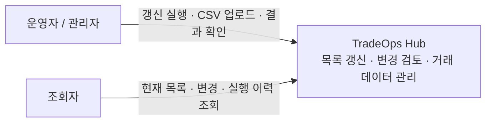
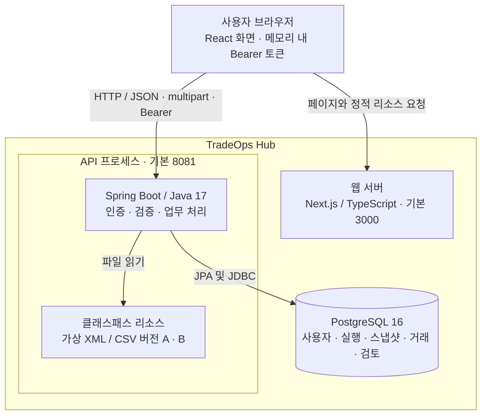
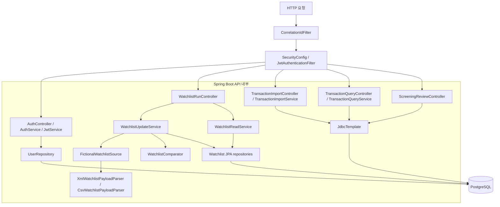

# C4 모델

기준일: 2026-09-08. 현재 코드의 시스템 경계와 의존성을 설명합니다. 각 도식은 C4의 맥락·컨테이너·컴포넌트 관점을 Mermaid로 표현했습니다. 서비스 클래스는 API 프로세스 내부 컴포넌트입니다.

## 1. 시스템 맥락

현재 원본은 애플리케이션에 포함된 가상 데이터입니다. 외부 공급자, 자동 수집 작업, 자동 매칭 엔진은 연결되어 있지 않습니다. 검토 API는 호출자가 전달한 점수와 처분을 기록하며, 점수를 계산하거나 법적 결론을 내리지 않습니다. 검토 API의 조회자 쓰기 차단은 [미완료 항목](../arc42.md#11-위험과-기술-부채)입니다.

## 2. 컨테이너

웹 서버가 API 요청을 중계하지 않습니다. `page.tsx`의 클라이언트 코드가 API를 직접 호출하며, 허용 origin은 기본 `http://localhost:3000`입니다. Docker Compose는 PostgreSQL만 실행합니다. API와 웹은 별도 프로세스이며 H2는 백엔드 테스트에서 사용합니다. TLS 종단, 메시지 큐, 별도 검색 서버는 현재 구성에 없습니다.

## 3. API 컴포넌트

목록 갱신은 `WatchlistUpdateService.run()`의 트랜잭션에서 실행·스냅샷·행·변경 기록을 저장합니다. 현재 목록은 별도 테이블을 덮어쓰지 않고 해당 공급자의 가장 큰 스냅샷 ID를 조회합니다. 변경 조회도 최신 스냅샷을 기준으로 합니다.

거래 가져오기와 검색은 서비스에서 `JdbcTemplate`을 직접 사용합니다. 검토 기록은 아직 컨트롤러에서 두 번의 SQL 쓰기를 실행합니다. 서비스·저장소 분리와 검토/감사의 원자적 저장은 목표 구조이며, 이 도식은 현재의 직접 의존성을 표시합니다.

## 4. 코드 탐색

전체 클래스 다이어그램 대신 변경 책임별 진입점을 연결합니다.

| 책임 | 코드 |
| --- | --- |
| 권한 정책 | [SecurityConfig](../../backend/src/main/java/io/tradeops/auth/SecurityConfig.java) |
| 갱신 트랜잭션 | [WatchlistUpdateService](../../backend/src/main/java/io/tradeops/watchlist/service/WatchlistUpdateService.java) |
| 식별자와 내용 비교 | [WatchlistComparator](../../backend/src/main/java/io/tradeops/watchlist/service/WatchlistComparator.java) |
| 최신 목록 조회 | [WatchlistReadService](../../backend/src/main/java/io/tradeops/watchlist/service/WatchlistReadService.java) |
| 거래 입력 처리 | [TransactionImportService](../../backend/src/main/java/io/tradeops/importer/TransactionImportService.java) |
| 화면과 API 호출 | [page.tsx](../../frontend/src/app/page.tsx) |
| 데이터 모델 | [Flyway 마이그레이션](../../backend/src/main/resources/db/migration) |

설계 선택의 이유는 [ADR](../adr/README.md), 실행·운영 관점은 [arc42](../arc42.md)에 기록합니다.
