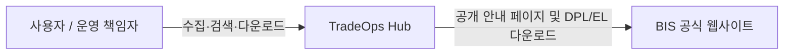
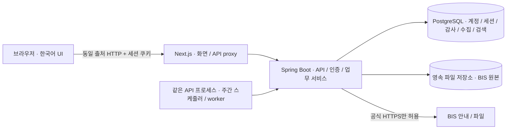
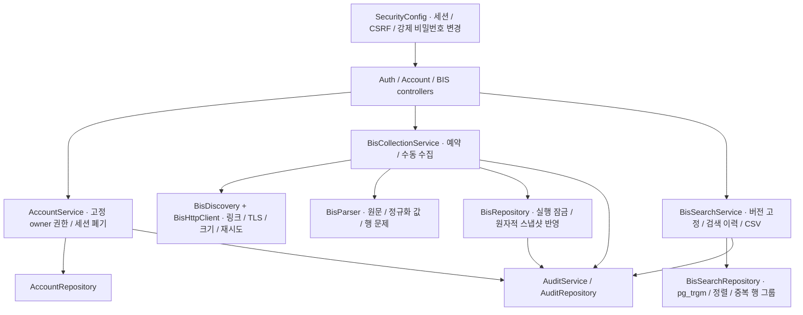

# C4 architecture

## System context

## Containers

## API components

## Deployment boundary

One Next.js process, **one** Spring Boot process (including scheduler), one PostgreSQL database and an original-file volume. DB transactions protect source pointers; the worker and restart recovery assume a single API instance. Do not scale API replicas without a distributed lease and worker recovery redesign. Production TLS terminates at the trusted ingress; use Secure cookies. API health exposes safe component state only.

Historical V1–V4 tables remain; active collection/search uses V5–V8 tables. Detail and CSV read immutable snapshot rows rather than a mutable current-list table.
