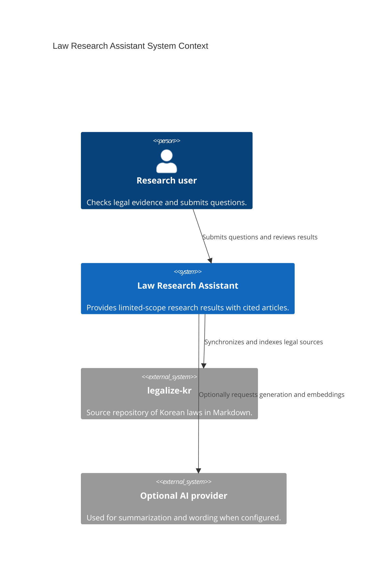
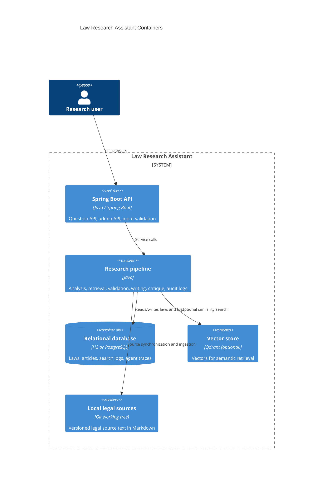

# C4 Architecture Overview

[한국어](../../ko/architecture/c4.md) | [English](../../en/architecture/c4.md)

This document describes the implemented structure from a C4 perspective. It reflects actual code and execution flows, not a future target architecture.

## Level 1 — System Context



Users submit questions, and the service retrieves locally indexed legal articles to answer with evidence. AI providers are optional; provider failures or insufficient evidence are not hidden when answering.

## Level 2 — Containers



H2 can be used in the default development environment; PostgreSQL is used in environments closer to real operation. Qdrant and external AI providers are optional components enabled through configuration.

## Level 3 — Core Request Components

```mermaid
flowchart LR
    controller[AskController]
    orchestrator[AskOrchestratorService]
    analyzer[QueryAnalyzerAgent]
    retrieval[RetrievalAgent]
    validator[EvidenceValidatorAgent]
    writer[AnswerWriterAgent]
    critic[CriticAgent]
    log[SearchLogAgent]

    controller --> orchestrator
    orchestrator --> analyzer
    analyzer --> retrieval
    retrieval --> validator
    validator --> writer
    writer --> critic
    critic --> log
```



Successful request traces retain the following order.

```text
QueryAnalyzerAgent -> RetrievalAgent -> EvidenceValidatorAgent -> AnswerWriterAndCritic
```

`AskController` handles only HTTP requests and responses. Services and agents handle analysis, retrieval, evidence validation, answer writing, critique, and audit logging.

## Core Invariants

- A `status=OK` response must contain at least one `citedArticles` item.
- A `LOW_CONFIDENCE` response with retrieved or hydrated evidence must also contain at least one cited article.
- Do not generate ungrounded law names, article numbers, or legal conclusions.
- Return `INSUFFICIENT_INFO` or follow-up questions when facts are insufficient.
- Answer evidence includes `snapshotVersion`, `indexedAt`, `sourcePath`, and `sourceVersion`.
- The same request has the same `requestId` in response diagnostics, search logs, and agent traces.

## Related Documents

- [arc42 Lite overview](../arc42-lite.md)
- [Architecture Decision Records (ADR)](../adr/README.md)
- [Runbook](../runbook.md)
- [Original project parity](../original-parity.md)
