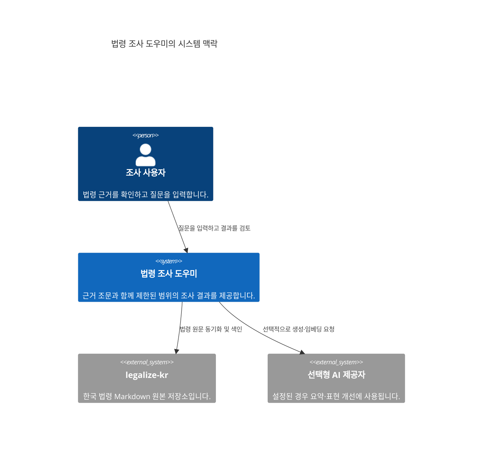
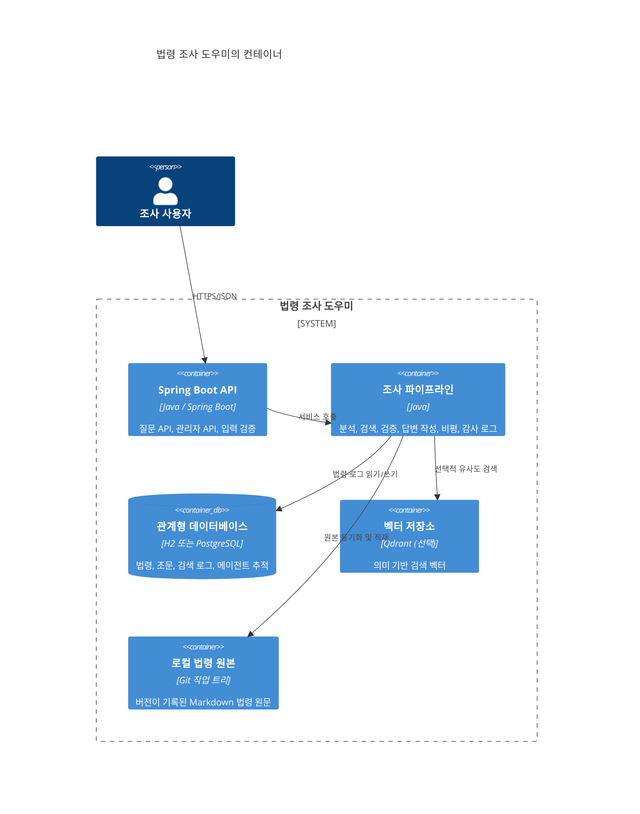

# C4 아키텍처 개요

[한국어](../../ko/architecture/c4.md) | [English](../../en/architecture/c4.md)

이 문서는 현재 구현된 구조를 C4 관점에서 간단히 설명합니다. 미래의 목표 구조가 아니라, 실제 코드와 실행 흐름을 기준으로 작성했습니다.

## 1단계 — 시스템 맥락



사용자는 질문을 보내고, 서비스는 로컬에 색인된 법령 조문을 찾아 근거와 함께 답변합니다. AI 제공자는 선택 사항이며, 제공자 오류나 근거 부족을 숨긴 채 답변하지 않습니다.

## 2단계 — 컨테이너



기본 개발 환경에서는 H2를 사용할 수 있고, 실제 사용에 가까운 환경에서는 PostgreSQL을 사용합니다. Qdrant와 외부 AI 제공자는 설정에 따라 활성화되는 선택형 구성 요소입니다.

## 3단계 — 핵심 요청 컴포넌트

```mermaid
flowchart LR
    controller[AskController]
    orchestrator[AskOrchestratorService]
    analyzer[QueryAnalyzerAgent]
    retrieval[RetrievalAgent]
    validator[EvidenceValidatorAgent]
    writer[AnswerWriterAgent]
    critic[CriticAgent]
    log[SearchLogAgent]

    controller --> orchestrator
    orchestrator --> analyzer
    analyzer --> retrieval
    retrieval --> validator
    validator --> writer
    writer --> critic
    critic --> log
```



정상 요청의 추적 단계는 다음 순서를 유지합니다.

```text
QueryAnalyzerAgent -> RetrievalAgent -> EvidenceValidatorAgent -> AnswerWriterAndCritic
```

`AskController`는 HTTP 요청과 응답만 다룹니다. 질문 분석, 검색, 근거 검증, 답변 작성, 비평, 감사 로그 처리는 서비스와 에이전트가 담당합니다.

## 핵심 불변 조건

- `status=OK` 응답에는 최소 한 개의 `citedArticles`가 반드시 포함됩니다.
- 검색 또는 원문 보강 결과가 있는 `LOW_CONFIDENCE` 응답에도 최소 한 개의 인용 조문이 포함됩니다.
- 근거 없는 법령명, 조문 번호, 법률 결론을 생성하지 않습니다.
- 사실이 부족한 질문에는 `INSUFFICIENT_INFO` 또는 추가 질문을 반환합니다.
- 답변 근거에는 `snapshotVersion`, `indexedAt`, `sourcePath`, `sourceVersion`을 포함합니다.
- 동일 요청의 `requestId`는 응답 진단 정보, 검색 로그, 에이전트 추적에서 동일합니다.

## 관련 문서

- [arc42 Lite 개요](../arc42-lite.md)
- [아키텍처 결정 기록(ADR)](../adr/README.md)
- [실행 및 운영 안내](../runbook.md)
- [원본 프로젝트 기능 대응표](../original-parity.md)
