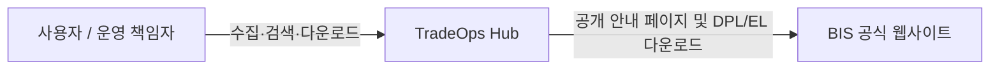
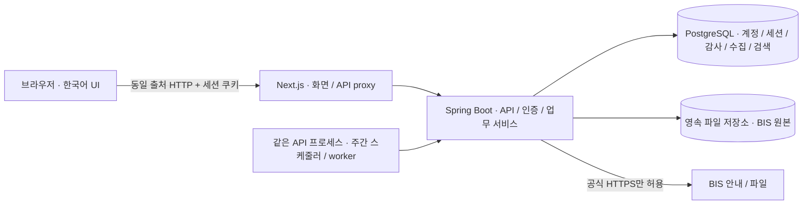
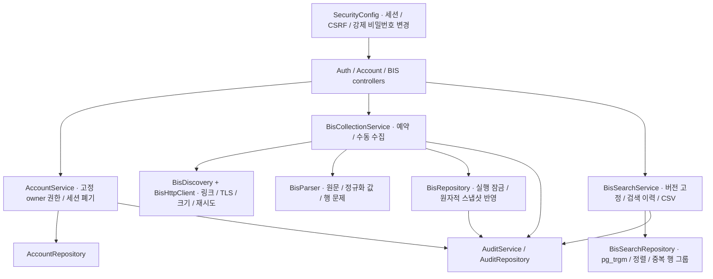
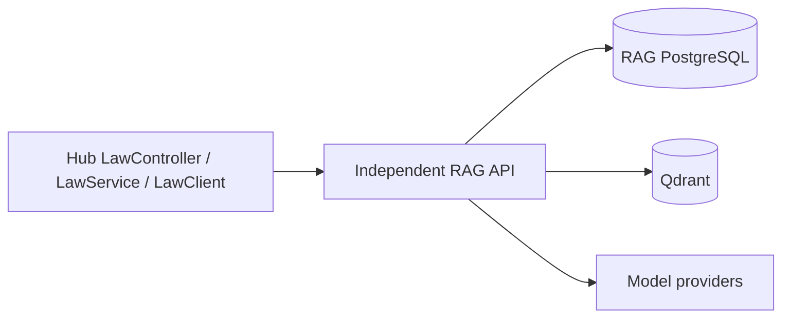

# C4 아키텍처

[한국어](c4.md) · [English](../../en/architecture/c4.md)

## 시스템 범위

## 실행 구성

## API 컴포넌트

## 배포 경계

코드는 모노레포의 `frontend/`, `backend/`, `services/law-search/`로 구분한다. 법령 API는 별도 프로세스·컨테이너와 PostgreSQL·Qdrant를 유지한다. 아래 단일 API 제약은 Hub/BIS 작업자에 대한 것이며 JVM을 합친다는 뜻이 아니다. [모노레포 운영](../monorepo.md)을 참고한다.

Next.js 프로세스 1개, 스케줄러를 포함한 Spring Boot 프로세스 **1개**, PostgreSQL DB 1개와 원본 파일 볼륨으로 구성한다. DB 트랜잭션으로 현재 출처 버전 연결을 보호하지만 작업 실행·재시작 복구는 단일 API를 가정한다. 분산 작업 임대와 복구 설계를 도입하기 전 API 복제본을 늘리지 않는다. 운영 TLS는 신뢰하는 진입점에서 종료하고 Secure 쿠키를 사용한다. 상태 API는 안전한 구성 요소 상태만 공개한다.

과거 V1–V4 테이블은 보존한다. 현재 수집·검색은 V5–V8 테이블을 사용한다. 상세·CSV는 변경 가능한 현재 목록 테이블이 아니라 불변 스냅샷 행을 읽는다.

법령 검색은 별도 RAG 서비스와 연동한다. 질문·인용·조문 이력/비교와 권한·데이터 보존은 [법령 검색 통합](../law-integration.md)을 참고한다.

