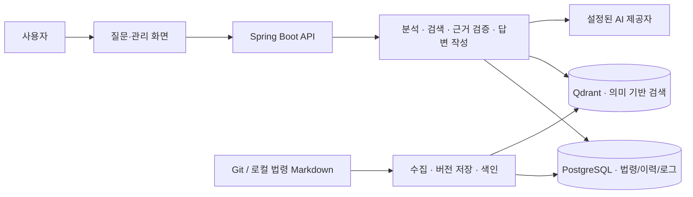

# 법령 검색 어시스턴트

전략물자·방산·기술보호 관련 법령을 자연어로 검색하는 서비스입니다. 질문에 맞는 조문을 찾고, 답변과 인용 근거·추가 확인 질문을 함께 제공합니다.

- 관련 분야 선택과 기준일을 반영한 법령 검색
- 키워드 검색과 의미 기반 검색을 결합한 조문 조회
- 검색 근거와 답변 품질 검증, 근거가 약하거나 정보가 부족한 경우의 안내
- 인용 조문 펼치기, 변경 이력 조회와 이전 조문 비교
- 법령 원문 수집, 버전 보관, 색인 상태와 처리 이력 관리
- 요청 ID로 답변·검색 로그·에이전트 처리 단계를 연결하는 운영 점검

검색 대상은 무역안보 관련 8개 핵심 법령과 수집된 하위 법령입니다. 대한민국 전체 법령을 실시간으로 조회하는 서비스가 아니며, 답변은 최종 법률 판단을 대신하지 않습니다.

[TradeOps Hub 모노레포](../../README.md)의 `services/law-search/`에서 관리합니다. 사용자 화면과 인증은 루트의 frontend/backend가, 이 서비스는 법령 데이터와 검색·답변을 담당합니다. [통합 운영 기준](../../docs/ko/monorepo.md)이 과거 저장소 분리 인계 문서보다 우선합니다. 아래 명령은 이 서비스 디렉터리 기준입니다.

## 실행

Java 17과 Maven이 필요합니다. PostgreSQL·Qdrant 실행에는 Docker, 로컬 검증의 JavaScript 문법 검사에는 Node.js가 필요합니다. 아래는 Windows PowerShell 기준입니다.

1. 새 환경에서는 [.env.example](.env.example)을 참고해 `.env`를 작성합니다. DB 비밀번호, 사용할 모델 제공자와 API 키, 법령 원문 경로를 설정합니다. 기존 `.env`는 덮어쓰지 않습니다.
2. PostgreSQL·Qdrant를 사용한다면 `powershell -File scripts/infra.ps1 up`으로 실행합니다. `.env`의 DB 연결과 `VECTOR_PROVIDER=qdrant` 설정을 맞춥니다.
3. `powershell -File scripts/preflight.ps1`로 설정을 점검합니다.
4. `powershell -File scripts/server.ps1 start`로 서버를 실행합니다. Maven이 PATH에 없다면 `-MavenPath <mvn.cmd 경로>`를 추가합니다.
5. 기본 주소 `http://localhost:8080`에 접속합니다. 첫 데이터 수집이 필요한 환경은 [운영 안내](docs/ko/runbook.md)를 따릅니다.

서버 상태 확인과 중지는 `scripts/server.ps1 status`, `scripts/server.ps1 stop`을 사용합니다. 기존 DB·벡터 데이터가 있다면 재시작만을 위해 재수집하거나 재임베딩할 필요가 없습니다. 설정 예시의 mock 모드는 실제 모델을 호출하지 않으므로 실제 검색 환경과 구분해야 합니다.

## 검증

서버 없이 설정·스크립트·JavaScript 문법·Maven 테스트를 확인하려면 다음 명령을 사용합니다. 단, 실제 DB가 설정된 환경에서는 [운영 안내의 테스트 격리 절차](docs/ko/runbook.md)를 먼저 따릅니다. 현재 기본 테스트 명령은 로컬 DB와의 자동 격리를 보장하지 않습니다.

```powershell
powershell -File scripts/verify-local.ps1 -MavenPath <mvn.cmd 경로>
```

실제 모델과 실행 중인 서버를 검증할 때는 아래 순서로 진행합니다.

```powershell
powershell -File scripts/verify-readiness.ps1 -RequireExternalProviders
# 설정 점검 후 서버를 실행합니다.
powershell -File scripts/verify-final.ps1
```

검증 스크립트는 서버를 시작, 중지, 재시작하지 않습니다. 최종 검증은 설정된 외부 모델을 호출하므로 비용과 대기 시간이 발생할 수 있습니다. Qdrant·Cohere를 필수로 검증하려면 `-RequireQdrant`, `-RequireCohere`를 사용합니다. 결과는 `target/evidence-report.md`와 관련 JSON 파일에 기록됩니다. 세부 기준은 [검증 안내](docs/ko/evaluation-harness.md)와 [실행 준비 점검](docs/ko/runtime-readiness.md)을 참고하세요.

## 아키텍처



위 그림은 PostgreSQL·Qdrant를 사용하는 구성입니다. 개발·검증 환경에서는 H2와 메모리 벡터 저장소를 사용할 수 있습니다. 질문·관리 화면은 Spring Boot에서 제공하는 HTML·CSS·JavaScript이며, 별도 프런트엔드 서버 없이 실행됩니다.

질문은 분석, 검색, 근거 검증, 답변 작성과 최종 품질 검사를 거칩니다. `OK` 답변에는 인용 조문이 반드시 포함되며, 약한 근거·정보 부족·처리 실패를 구분합니다. 응답과 검색 로그, 에이전트 추적은 같은 요청 ID로 연결됩니다.

법령 데이터는 수집한 버전과 출처를 보관하고 기준일에 맞는 조문을 조회합니다. Qdrant에 저장된 기존 색인은 재시작 시 재사용합니다. 수집·색인 변경과 질문 처리는 별도 작업입니다. 검색·답변 로직은 모델 제공자 인터페이스 뒤에 두어 설정으로 구현을 선택합니다.

## 설계 문서

[전체 한·영 문서 목록](docs/README.md) · [한국어 문서](docs/ko/README.md) · [English documentation](docs/en/README.md)

| 문서 | 내용 |
| --- | --- |
| [C4 모델](docs/ko/architecture/c4.md) | 시스템 경계와 구성요소 |
| [ADR](docs/ko/adr/README.md) | 주요 설계 결정과 이유 |
| [arc42](docs/ko/arc42-lite.md) | 요구사항, 품질 목표와 제약 |
| [제품 명세](docs/ko/product-spec.md) | 기능과 제품 범위 |
| [API 계약](docs/ko/api-contract.md) | 요청·응답과 검증 규칙 |
| [질문 처리 구조](docs/ko/agent-orchestration.md) | 분석·검색·답변·검증 단계 |
| [상세 아키텍처](docs/ko/architecture.md) | 검색, 수집, 데이터와 로그 설계 |
| [분야 선택](docs/ko/research-area-selection.md) | 전략물자·방산 분야 선택의 동작 |
| [운영 안내](docs/ko/runbook.md) | 환경 설정, 실행, 수집과 장애 점검 |
| [검증 안내](docs/ko/evaluation-harness.md) | 고정 질문과 회귀 검증 기준 |
| [TradeOps Hub 연동](docs/ko/tradeops-integration-handoff.md) | 화면·인증 연결과 데이터 보존 |
| [문서 언어 기준](docs/ko/documentation-language.md) | 한·영 문서 대응과 한국어 화면 관리 규칙 |

개발자용 API 테스트는 `http://localhost:8080/swagger-ui/index.html`, 운영 상태는 `GET /api/admin/status`에서 확인할 수 있습니다. 상단 메뉴에서는 질문·관리만 제공합니다.

공개 법령 원문을 사용하며, 회사 내부 코드·데이터·계정 정보를 포함하지 않습니다. 질문 전문을 운영 로그에 기록하지 않고 요청 ID·해시·길이·마스킹된 짧은 미리보기를 사용합니다. `.env`, 수집 원문, DB·벡터 데이터와 생성된 검증 결과는 Git에 포함하지 않습니다.
